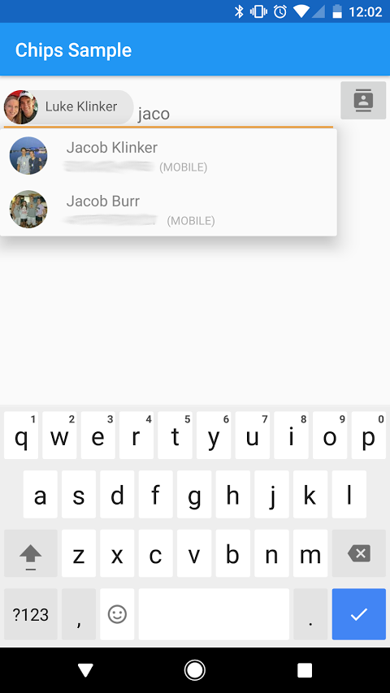

# Android Chips Edit Text #



This is a simple library based on Google's internal chips library and updated to have visuals reflecting the newly released "Material Design" standard
Usage is extremely simple:

```java
// creates an autocomplete for phone number contacts
final RecipientEditTextView phoneRetv =
        (RecipientEditTextView) findViewById(R.id.phone_retv);
phoneRetv.setTokenizer(new MultiAutoCompleteTextView.CommaTokenizer());
BaseRecipientAdapter baseRecipientAdapter = new BaseRecipientAdapter(BaseRecipientAdapter.QUERY_TYPE_PHONE, this);

// Queries for all phone numbers. Includes phone numbers marked as "mobile" and "others".
// If set as true, baseRecipientAdapter will query only for phone numbers marked as "mobile".  
baseRecipientAdapter.setShowMobileOnly(false);

phoneRetv.setAdapter(baseRecipientAdapter);


```

OR

```java
// creates an autocomplete for email contacts
final RecipientEditTextView emailRetv =
        (RecipientEditTextView) findViewById(R.id.email_retv);
emailRetv.setTokenizer(new Rfc822Tokenizer());
emailRetv.setAdapter(new BaseRecipientAdapter(this));
```

You can get all of the current chips by using:

```java
DrawableRecipientChip[] chips = phoneRetv.getSortedRecipients();
```


## Gradle

To include in your gradle project:

```groovy
compile 'com.github.gaochunchun:android-autocomplete:Tag'
```
---

